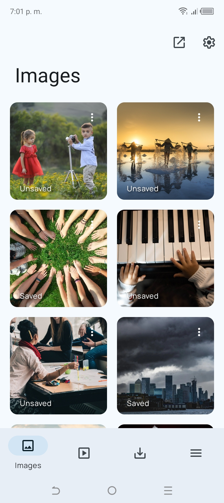
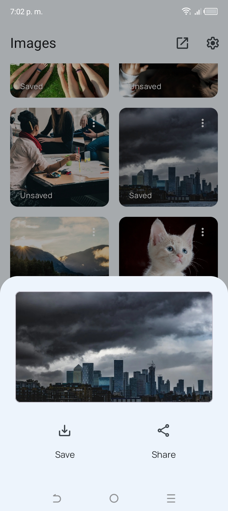
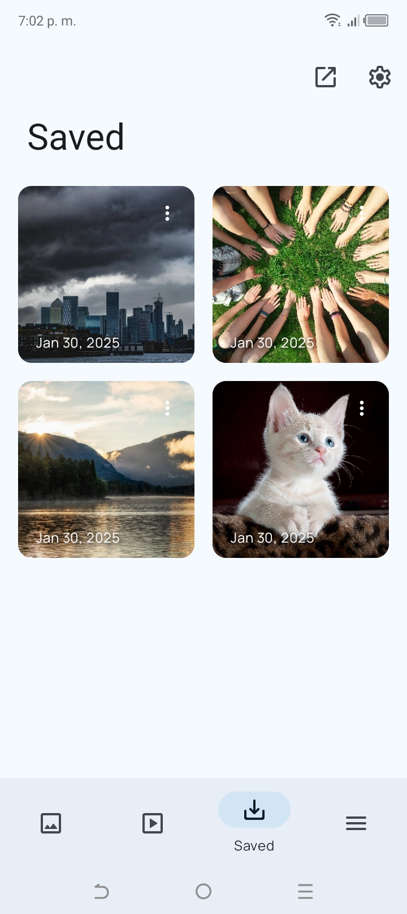
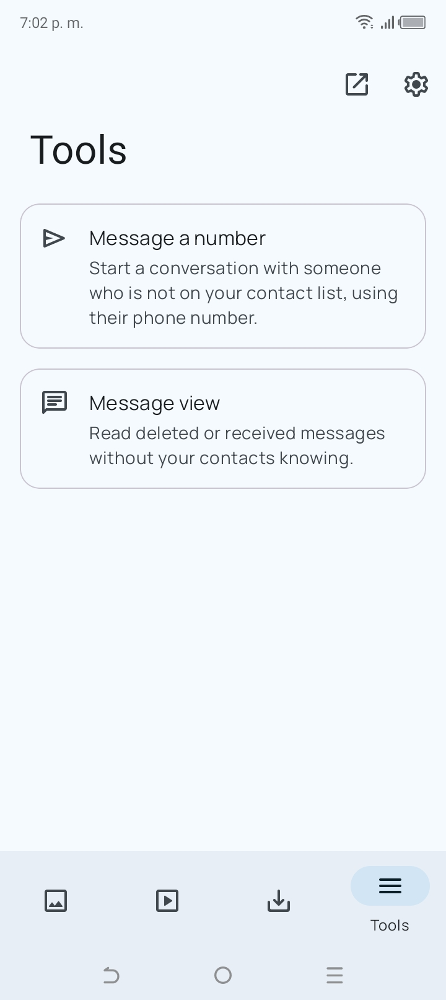
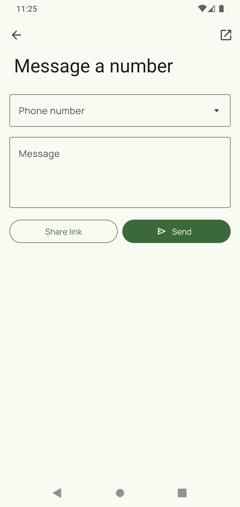

# WhatSave

### Una aplicación que te ayuda a guardar los estados de WA de la forma más sencilla.

[English](README.md)
&nbsp;&nbsp;|&nbsp;&nbsp;
Español

## 📱 Screenshots

## 📃 Características:

* Soporte para todas las versiones de Android desde 7.0 Nougat
* Material You en Android 12 y superiores
* Previsualiza y guarda archivos
* Recupera mensajes eliminados
* Modo nocturno
* Tema completamente negro
* Sin publicidad
* Sin marca de agua
* ¡Es gratis!

## ⬇️ Descargar
Puedes descargar WhatSave desde [F-Droid](https://f-droid.org/packages/com.simplified.wsstatussaver) y también desde [GitHub Releases](https://github.com/mardous/WhatSave/releases/latest).

## 🤝 Contribuciones
Si estás interesado en contribuir a este proyecto, ¡gracias! Puedes leer [este texto (en inglés)](CONTRIBUTING.md) para obtener más detalles.

Las [traducciones de esta app](https://hosted.weblate.org/projects/whatsave/) son posibles gracias a [Hosted Weblate](https://hosted.weblate.org/about/).

## 🔏 Privacidad y términos
Por favor, lee [este texto (en inglés)](PRIVACY.md) si quieres saber más acerca de nuestra Política de Privacidad y Términos de Uso.

## ⚖️ Licencia
WhatSave está licenciado bajo los términos de la [Licencia Pública General de GNU, Versión 3.0](LICENSE.md).
Cualquier proyecto derivado debe mantener esta misma licencia por obligaciones legales.

## ⚠️ Aclaración
Esta aplicación y/o su desarrollador no están relacionados de ninguna manera con otras compañias o marcas comerciales.